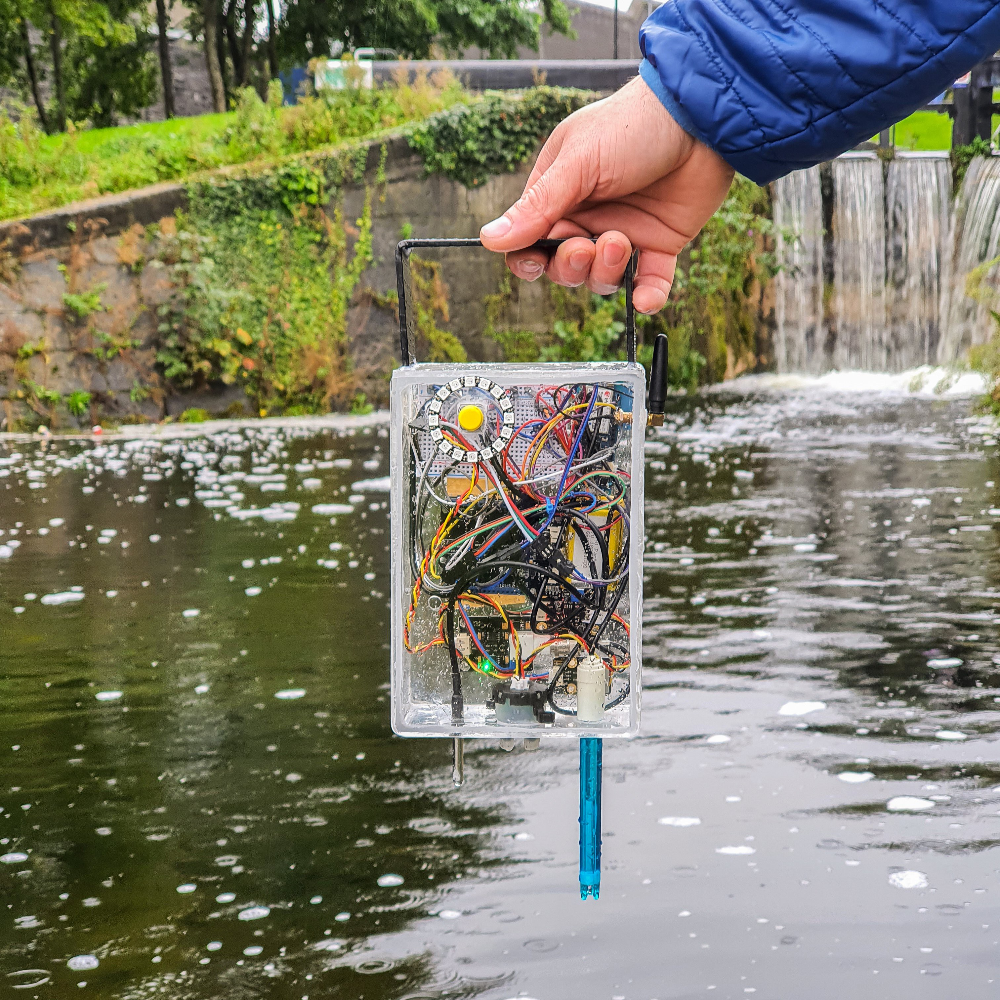

<!-- @format -->

# Abstract

Yearly, over 8 billion tonnes of plastic enter the world’s oceans among other waste; from companies dejecting their waste products to individuals blind to bins, we all contribute to this number.

A staggering 80% of water pollution is directly or indirectly caused by humans, making water pollution one of the greatest challenges our society has faced to sate.

Water quality monitoring is essential for the identification of risks for human health and environmental issues and with growing awareness about this problem, designing accurate and robust devices that monitor and track water quality is essential.
UnifiedWater is a system that allows for the easy monitoring of water quality from anywhere in the world. The device is equipped with multiple sensors that collectively monitor the overall quality of the water. This data is streamed live to Azure IoT Central where it is then displayed on a dashboard.

UnifiedWater is an affordable, mass producible, and open source application which allows governments, private associations, and even individuals to take water quality readings and share them with the community, enabling data analysis and observations which can allow authorities to identify places that are being polluted (rivers, lakes, seas, oceans) and take appropriate action to ensure that the water is clean.

UnifiedWater operates in two modes: the device to be stationed at one point along a body of water and stream a consistent flow of data or be used to take single samples at various points along one or multiple bodies of water, hence making it easier and more cost-effective to identify the source of pollutants. The latter function is novel to our proposed system.

# Repository Structure

This repository centralises all public documents and code for UnifiedWater. The table below gives a high-level overview of the repo's structure.

| Item               | Description                                                                                                                   |
| ------------------ | ----------------------------------------------------------------------------------------------------------------------------- |
| Backend            | Contains Azure IoT Central configuration files                                                                                |
| UnifiedWater       | The source code of the application                                                                                            |
| LowPowerEnterprise | The source code for an updated version of the application which leverages the Arduino's Low Power Mode to increase efficiency |

# Getting Started

The steps for constructing the project are all documented in this [Hackaday blog post](https://hackaday.io/project/174026-unifiedwater).
